    

## Setup

### Load packages


```r
library(ggplot2)
library(dplyr)
library(statsr)
library(BAS)
library(tidyr)
library(cowplot)
library(ggplotify)
library(purrr)
```

### Load data


```r
load("movies.Rdata")
```


* * *

## Part 1: Data 

The data is a random sample of 651 movies produced and released before 2016. Thus, hypothetically, it can be generalized to the population of American movies. However, a few factors may give rise to bias such as the fact that this dataset includes only English movies released in US theatres, Aditionally, let's look at the distribution of the theatrical release years below. As you can see, it is left skewed, with majority of the observations coming from the later years. Thus, we **have some concerns with generalizability**. 

Furthermore, since this is an observational study and there is **no random assigment, we cannot infer causality.** 


```r
hist(movies$thtr_rel_year,breaks=c(1970:2016))
```

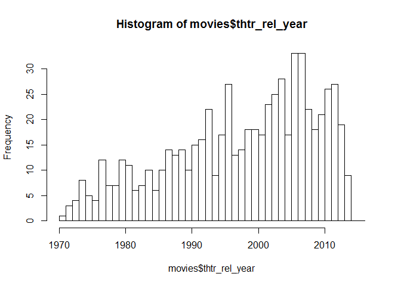<!-- -->


* * *

## Part 2: Data manipulation

In this section we create new variables `feature_film`, `drama`, `mpaa_rating_R`, `oscar_season`, and `summer_season`. 


```r
movies2<-movies #copy to a new variable so that original data remains untouched 

movies2<-mutate(movies2, feature_film=ifelse(title_type=="Feature Film","yes","no"))%>%mutate(feature_film=as.factor(feature_film))
movies2<-mutate(movies2, drama=ifelse(genre=="Drama","yes","no"))%>%mutate(drama=as.factor(drama))
movies2<-mutate(movies2, mpaa_rating_R=ifelse(mpaa_rating=="R","yes","no"))%>%mutate(mpaa_rating_R=as.factor(mpaa_rating_R))
movies2<-mutate(movies2, oscar_season=ifelse(thtr_rel_month>=10,"yes","no"))%>%mutate(oscar_season=as.factor(oscar_season))
movies2<-mutate(movies2, summer_season=ifelse(thtr_rel_month %in% 5:8,"yes","no"))%>%mutate(summer_season=as.factor(summer_season))

str(movies2)
```

```
## tibble [651 x 37] (S3: tbl_df/tbl/data.frame)
##  $ title           : chr [1:651] "Filly Brown" "The Dish" "Waiting for Guffman" "The Age of Innocence" ...
##  $ title_type      : Factor w/ 3 levels "Documentary",..: 2 2 2 2 2 1 2 2 1 2 ...
##  $ genre           : Factor w/ 11 levels "Action & Adventure",..: 6 6 4 6 7 5 6 6 5 6 ...
##  $ runtime         : num [1:651] 80 101 84 139 90 78 142 93 88 119 ...
##  $ mpaa_rating     : Factor w/ 6 levels "G","NC-17","PG",..: 5 4 5 3 5 6 4 5 6 6 ...
##  $ studio          : Factor w/ 211 levels "20th Century Fox",..: 91 202 167 34 13 163 147 118 88 84 ...
##  $ thtr_rel_year   : num [1:651] 2013 2001 1996 1993 2004 ...
##  $ thtr_rel_month  : num [1:651] 4 3 8 10 9 1 1 11 9 3 ...
##  $ thtr_rel_day    : num [1:651] 19 14 21 1 10 15 1 8 7 2 ...
##  $ dvd_rel_year    : num [1:651] 2013 2001 2001 2001 2005 ...
##  $ dvd_rel_month   : num [1:651] 7 8 8 11 4 4 2 3 1 8 ...
##  $ dvd_rel_day     : num [1:651] 30 28 21 6 19 20 18 2 21 14 ...
##  $ imdb_rating     : num [1:651] 5.5 7.3 7.6 7.2 5.1 7.8 7.2 5.5 7.5 6.6 ...
##  $ imdb_num_votes  : int [1:651] 899 12285 22381 35096 2386 333 5016 2272 880 12496 ...
##  $ critics_rating  : Factor w/ 3 levels "Certified Fresh",..: 3 1 1 1 3 2 3 3 2 1 ...
##  $ critics_score   : num [1:651] 45 96 91 80 33 91 57 17 90 83 ...
##  $ audience_rating : Factor w/ 2 levels "Spilled","Upright": 2 2 2 2 1 2 2 1 2 2 ...
##  $ audience_score  : num [1:651] 73 81 91 76 27 86 76 47 89 66 ...
##  $ best_pic_nom    : Factor w/ 2 levels "no","yes": 1 1 1 1 1 1 1 1 1 1 ...
##  $ best_pic_win    : Factor w/ 2 levels "no","yes": 1 1 1 1 1 1 1 1 1 1 ...
##  $ best_actor_win  : Factor w/ 2 levels "no","yes": 1 1 1 2 1 1 1 2 1 1 ...
##  $ best_actress_win: Factor w/ 2 levels "no","yes": 1 1 1 1 1 1 1 1 1 1 ...
##  $ best_dir_win    : Factor w/ 2 levels "no","yes": 1 1 1 2 1 1 1 1 1 1 ...
##  $ top200_box      : Factor w/ 2 levels "no","yes": 1 1 1 1 1 1 1 1 1 1 ...
##  $ director        : chr [1:651] "Michael D. Olmos" "Rob Sitch" "Christopher Guest" "Martin Scorsese" ...
##  $ actor1          : chr [1:651] "Gina Rodriguez" "Sam Neill" "Christopher Guest" "Daniel Day-Lewis" ...
##  $ actor2          : chr [1:651] "Jenni Rivera" "Kevin Harrington" "Catherine O'Hara" "Michelle Pfeiffer" ...
##  $ actor3          : chr [1:651] "Lou Diamond Phillips" "Patrick Warburton" "Parker Posey" "Winona Ryder" ...
##  $ actor4          : chr [1:651] "Emilio Rivera" "Tom Long" "Eugene Levy" "Richard E. Grant" ...
##  $ actor5          : chr [1:651] "Joseph Julian Soria" "Genevieve Mooy" "Bob Balaban" "Alec McCowen" ...
##  $ imdb_url        : chr [1:651] "http://www.imdb.com/title/tt1869425/" "http://www.imdb.com/title/tt0205873/" "http://www.imdb.com/title/tt0118111/" "http://www.imdb.com/title/tt0106226/" ...
##  $ rt_url          : chr [1:651] "//www.rottentomatoes.com/m/filly_brown_2012/" "//www.rottentomatoes.com/m/dish/" "//www.rottentomatoes.com/m/waiting_for_guffman/" "//www.rottentomatoes.com/m/age_of_innocence/" ...
##  $ feature_film    : Factor w/ 2 levels "no","yes": 2 2 2 2 2 1 2 2 1 2 ...
##  $ drama           : Factor w/ 2 levels "no","yes": 2 2 1 2 1 1 2 2 1 2 ...
##  $ mpaa_rating_R   : Factor w/ 2 levels "no","yes": 2 1 2 1 2 1 1 2 1 1 ...
##  $ oscar_season    : Factor w/ 2 levels "no","yes": 1 1 1 2 1 1 1 2 1 1 ...
##  $ summer_season   : Factor w/ 2 levels "no","yes": 1 1 2 1 1 1 1 1 1 1 ...
```

* * *

## Part 3: Exploratory data analysis 

Let's look at the new variables we created in the previous section and their relationship with audience score below. 


```r
grep("audience_score",colnames(movies2))
```

```
## [1] 18
```

```r
movies_cat<-movies2[,c(18,33:37)]
movies_cat%>% gather(-audience_score, key = "var", value = "value") %>%
  ggplot(aes(x = value, y = audience_score)) +
    geom_boxplot() +
    facet_wrap(~ var, scales = "free",ncol=3) +
    theme_bw()+
    ggtitle("Categoric variables plotted against audience_score")
```

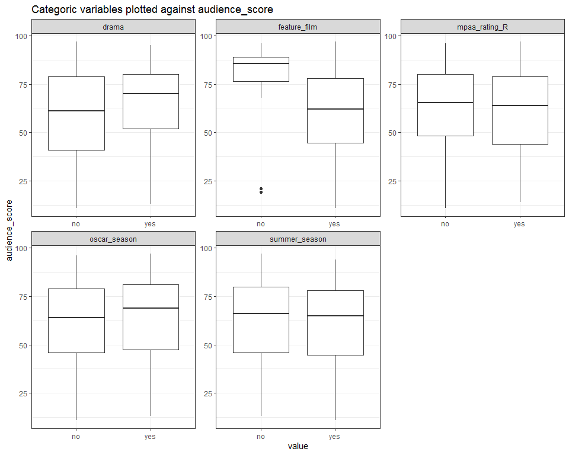<!-- -->

We observe from the above boxplots that `feature_film`, `drama`, and `oscar_season` seem to have a relationship with `audience_score`. Specifically, **drama films, non-feature films and films released during oscar season seem to have a higher audience score.** An R MPAA Rating and release during summer months does not seem to have a relationship with audience score. 

Let's look at numerical summary statistics to look at exact differences. 


```r
movies_cat%>%filter(!is.na(audience_score))%>%group_by(feature_film)%>%summarize(mean_score=mean(audience_score,na.rm=TRUE),count=n(),median_score=median(audience_score,na.rm=TRUE))
```

```
## # A tibble: 2 x 4
##   feature_film mean_score count median_score
##   <fct>             <dbl> <int>        <dbl>
## 1 no                 81.0    60         85.5
## 2 yes                60.5   591         62
```

```r
movies_cat%>%filter(!is.na(audience_score))%>%group_by(drama)%>%summarize(mean_score=mean(audience_score,na.rm=TRUE),count=n(),median_score=median(audience_score,na.rm=TRUE))
```

```
## # A tibble: 2 x 4
##   drama mean_score count median_score
##   <fct>      <dbl> <int>        <dbl>
## 1 no          59.7   346           61
## 2 yes         65.3   305           70
```

```r
movies_cat%>%filter(!is.na(audience_score))%>%group_by(mpaa_rating_R)%>%summarize(mean_score=mean(audience_score,na.rm=TRUE),count=n(),median_score=median(audience_score,na.rm=TRUE))
```

```
## # A tibble: 2 x 4
##   mpaa_rating_R mean_score count median_score
##   <fct>              <dbl> <int>        <dbl>
## 1 no                  62.7   322         65.5
## 2 yes                 62.0   329         64
```

```r
movies_cat%>%filter(!is.na(audience_score))%>%group_by(oscar_season)%>%summarize(mean_score=mean(audience_score,na.rm=TRUE),count=n(),median_score=median(audience_score,na.rm=TRUE))
```

```
## # A tibble: 2 x 4
##   oscar_season mean_score count median_score
##   <fct>             <dbl> <int>        <dbl>
## 1 no                 61.8   460           64
## 2 yes                63.7   191           69
```

```r
movies_cat%>%filter(!is.na(audience_score))%>%group_by(summer_season)%>%summarize(mean_score=mean(audience_score,na.rm=TRUE),count=n(),median_score=median(audience_score,na.rm=TRUE))
```

```
## # A tibble: 2 x 4
##   summer_season mean_score count median_score
##   <fct>              <dbl> <int>        <dbl>
## 1 no                  62.6   443           66
## 2 yes                 61.8   208           65
```

So we can see from the above summary statistics that the mean and median audience scores of non-feature films, dramas, and films released during oscar seasons are higher. We will create a bayesian model in the next part to understand the posterior inclusion probabilities of these variables. 


* * *

## Part 4: Modeling

Our boss is interested in learning what attributes make a movie popular. She is also interested in learning something new about movies. She wants our team to figure it all out. Based on this, we can formulate the research question as follows: 

**Find the movie attributes that are related to movie popularity.**

In this section, we want to construct a model that will help us understand the attributes that are related to the popularity of a movie. Popularity of a movie is defined in terms of the `audience_score`. Since there are 2^16 models, we will use MCMC to find the posterior probabilities of the models and coefficients. The prior used for the model coefficients is 'BIC' which is implying that the prior distribution $$ \beta = (\beta_{0},\beta_{1},...)^T $$ is uniformly flat. 


```r
set.seed(1234)

bma_score <- bas.lm(audience_score ~ feature_film+drama+runtime+mpaa_rating_R+thtr_rel_year+oscar_season+summer_season+critics_score+imdb_rating+imdb_num_votes+best_pic_nom+best_pic_win+best_actor_win+best_actress_win+best_dir_win+top200_box, data = movies2,
                   prior = "BIC", 
                   modelprior = uniform(),method="MCMC")
```

```
## Warning in bas.lm(audience_score ~ feature_film + drama + runtime +
## mpaa_rating_R + : dropping 1 rows due to missing data
```

```r
summary(bma_score)
```

```
##                     P(B != 0 | Y)    model 1       model 2       model 3
## Intercept              1.00000000     1.0000     1.0000000     1.0000000
## feature_filmyes        0.06530457     0.0000     0.0000000     0.0000000
## dramayes               0.04345703     0.0000     0.0000000     0.0000000
## runtime                0.46739502     1.0000     0.0000000     0.0000000
## mpaa_rating_Ryes       0.20256424     0.0000     0.0000000     0.0000000
## thtr_rel_year          0.08952408     0.0000     0.0000000     0.0000000
## oscar_seasonyes        0.07434311     0.0000     0.0000000     0.0000000
## summer_seasonyes       0.08067627     0.0000     0.0000000     0.0000000
## critics_score          0.88959274     1.0000     1.0000000     1.0000000
## imdb_rating            0.99999924     1.0000     1.0000000     1.0000000
## imdb_num_votes         0.05739670     0.0000     0.0000000     0.0000000
## best_pic_nomyes        0.13116531     0.0000     0.0000000     0.0000000
## best_pic_winyes        0.03961639     0.0000     0.0000000     0.0000000
## best_actor_winyes      0.14559784     0.0000     0.0000000     1.0000000
## best_actress_winyes    0.14091034     0.0000     0.0000000     0.0000000
## best_dir_winyes        0.06702347     0.0000     0.0000000     0.0000000
## top200_boxyes          0.04831924     0.0000     0.0000000     0.0000000
## BF                             NA     1.0000     0.9968489     0.2543185
## PostProbs                      NA     0.1289     0.1285000     0.0332000
## R2                             NA     0.7549     0.7525000     0.7539000
## dim                            NA     4.0000     3.0000000     4.0000000
## logmarg                        NA -3615.2791 -3615.2822108 -3616.6482224
##                           model 4       model 5
## Intercept               1.0000000     1.0000000
## feature_filmyes         0.0000000     0.0000000
## dramayes                0.0000000     0.0000000
## runtime                 0.0000000     1.0000000
## mpaa_rating_Ryes        1.0000000     1.0000000
## thtr_rel_year           0.0000000     0.0000000
## oscar_seasonyes         0.0000000     0.0000000
## summer_seasonyes        0.0000000     0.0000000
## critics_score           1.0000000     1.0000000
## imdb_rating             1.0000000     1.0000000
## imdb_num_votes          0.0000000     0.0000000
## best_pic_nomyes         0.0000000     0.0000000
## best_pic_winyes         0.0000000     0.0000000
## best_actor_winyes       0.0000000     0.0000000
## best_actress_winyes     0.0000000     0.0000000
## best_dir_winyes         0.0000000     0.0000000
## top200_boxyes           0.0000000     0.0000000
## BF                      0.2521327     0.2391994
## PostProbs               0.0329000     0.0305000
## R2                      0.7539000     0.7563000
## dim                     4.0000000     5.0000000
## logmarg             -3616.6568544 -3616.7095127
```

The above summary provides us the marginal posterior inclusion probabilities (pip) of each of the variables and then lists the variables included in the top 5 models. According to this summary, `imdb_rating` is including in every single model with a pip of 1. `critics_score` has the next highest pip of 0.89, followed by `runtime` with a pip of 0.47. The model with the highest posterior probability (0.1289) has the variables `imdb_rating`, `runtime`, and `critics_score`. 

`best_actor_win`, `best_actress_win` and `mpaa_rating_R` also have significant posterior inclusion probabilities. However, we should be careful of selecting the best model using these pips due to the presence of multicollinearity, as small posterior inclusion probability may arise when two or more variables are highly correlated. 

**Since even the best model has only posterior probability of 0.1289, we do not want to select any one model, but use Bayesian Model Averaging to determine coefficients and make predictions.**

### Model Coefficients


```r
coef.score=coef(bma_score,estimator="BMA")

a<-round(confint(coef.score)[,1:2],6)
b<-round(coef.score$postmean,6)
c<-round(coef.score$postsd,6)

result<-data.frame(b,c,a)

colnames(result)<-c("Posterior mean","Posterior STD","2.5%","97.5%")

result
```

```
##                     Posterior mean Posterior STD      2.5%     97.5%
## Intercept                62.347692      0.394601 61.604481 63.152630
## feature_filmyes          -0.104160      0.563163 -1.034192  0.005440
## dramayes                  0.016151      0.194396  0.000000  0.000000
## runtime                  -0.025552      0.031162 -0.082213  0.000021
## mpaa_rating_Ryes         -0.307718      0.707017 -2.131607  0.000000
## thtr_rel_year            -0.004459      0.018037 -0.052182  0.000000
## oscar_seasonyes          -0.079572      0.375447 -0.822971  0.000000
## summer_seasonyes          0.087309      0.383659  0.000000  0.984499
## critics_score             0.063044      0.030220  0.000000  0.106240
## imdb_rating              14.980098      0.730259 13.670935 16.493160
## imdb_num_votes            0.000000      0.000001 -0.000001  0.000001
## best_pic_nomyes           0.506188      1.566322  0.000000  4.805991
## best_pic_winyes          -0.009216      0.843606  0.000000  0.000000
## best_actor_winyes        -0.290141      0.834901 -2.674227  0.000000
## best_actress_winyes      -0.308693      0.905980 -2.876368  0.000000
## best_dir_winyes          -0.119611      0.622992 -1.299547  0.000000
## top200_boxyes             0.087594      0.709664  0.000000  0.000000
```


We can also graph the coefficients as follows: 


```r
plot(coef.score,ask=F)
```

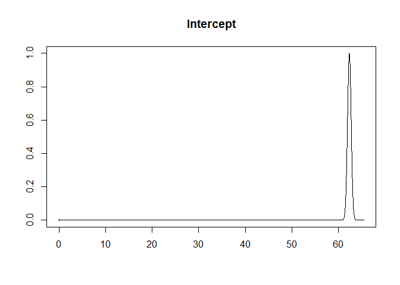<!-- -->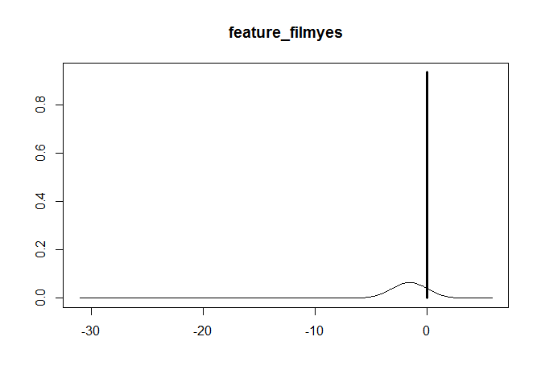<!-- -->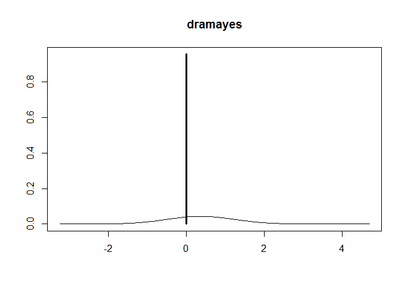<!-- -->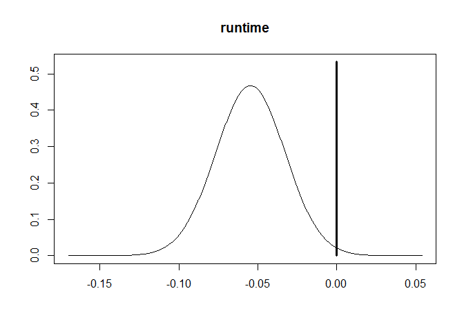<!-- -->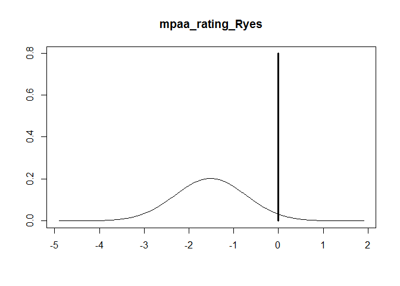<!-- -->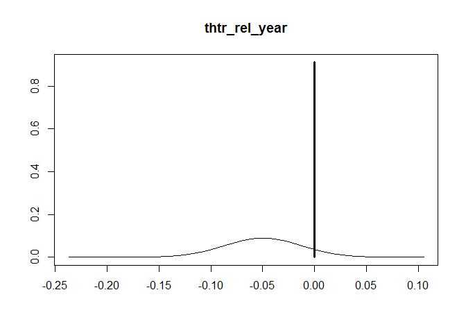<!-- -->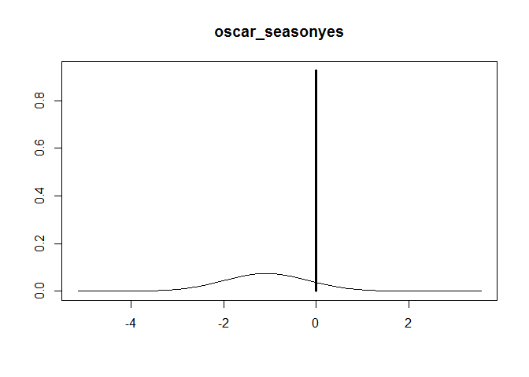<!-- -->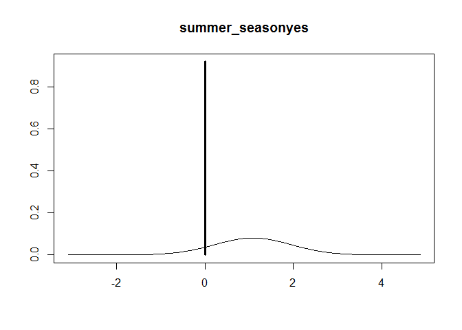<!-- -->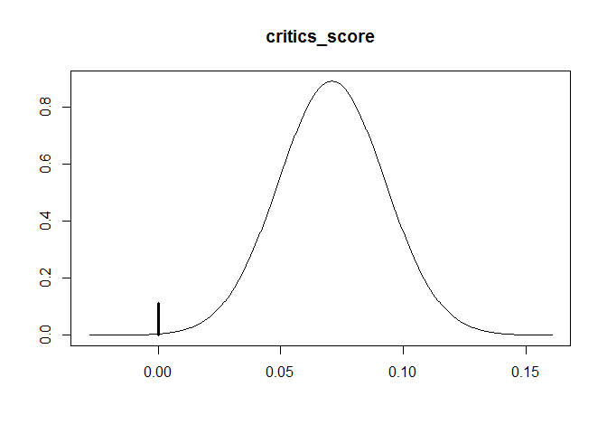<!-- -->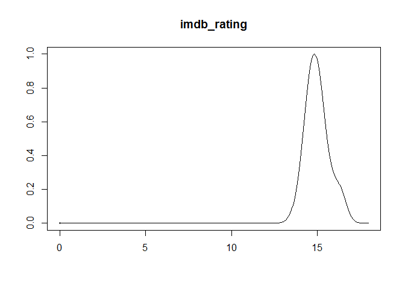<!-- -->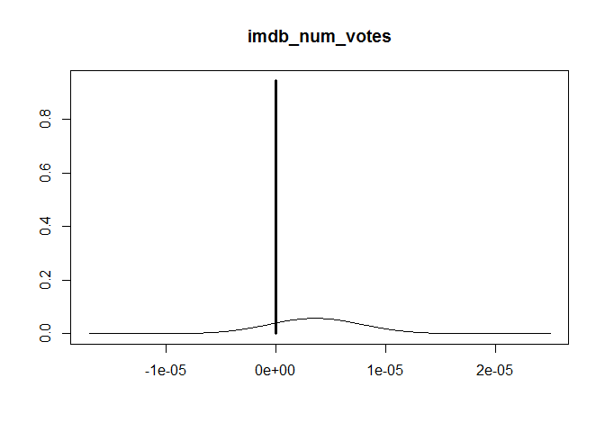<!-- -->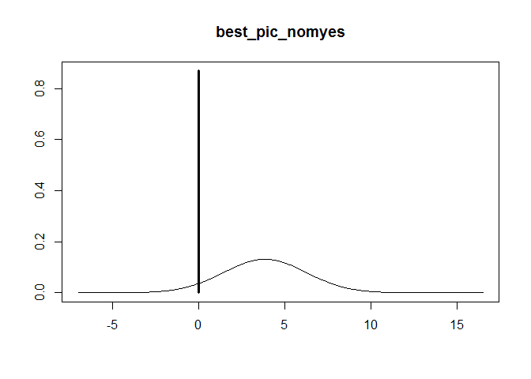<!-- -->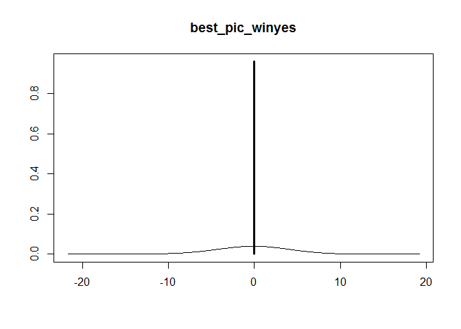<!-- -->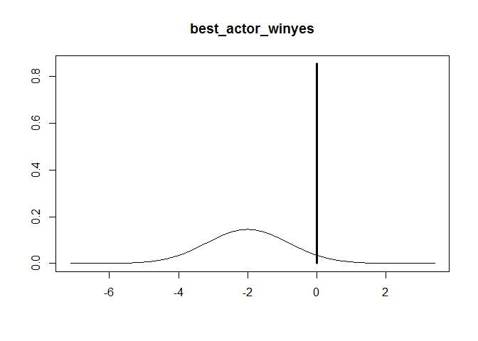<!-- -->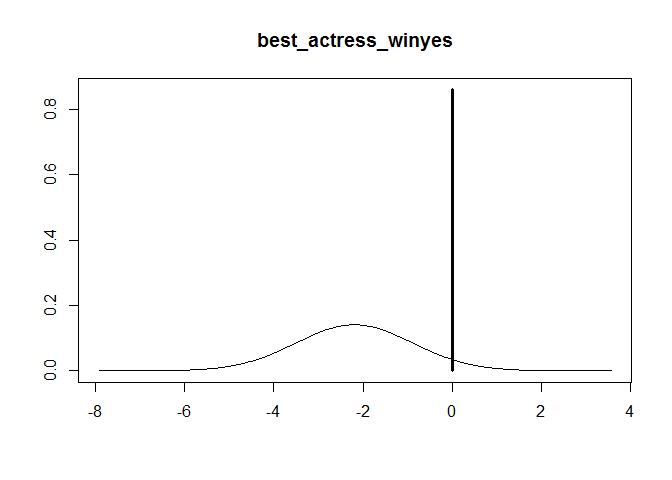<!-- -->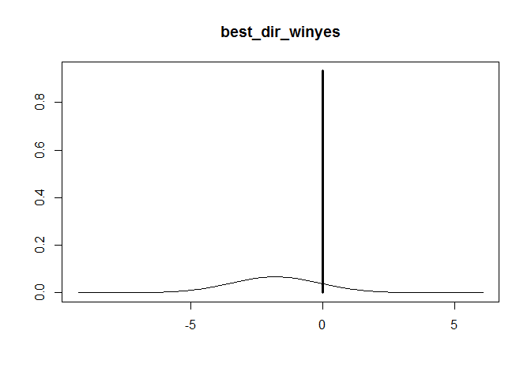<!-- -->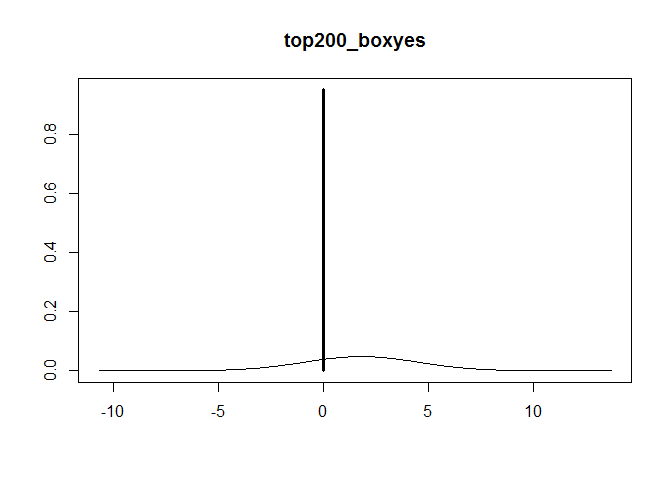<!-- -->

**Findings:**

* We can see that 0 is included in the credible intervals of `feature_film`, `drama`, `oscar_season`, and `summer_season`, indicating that these variables do not conclusively relate to the audience score in one particular direction. 

* `imdb_rating`,`critics_score`, and `runtime` have the least uncertainty in their posterior coefficients and the highest pips as seen from the plots. In the plots of these variables, there is a noticeable peak and the line at 0 is not as high as the other explanatory variables. A 1 point increase in IMDB rating increases the audience score by 14.98 points on average. A 1 point increase `critics_score` drives up the audience rating by 0.06 on average. An additional minute of `runtime` drives down audience score by 0.03 on average. 

* The `mpaa_rating_R` variable has medium uncertainty in its coefficients as seen in the slight bulge in the posterior plot. An R rated film on average has an audience score of 0.3 lower than a non-R rated film. 

* A best picture nomination in `best_pic_nom` drives up audience score by 0.5 points on average, while the `best_pic_win` has an almost negligible relationship with audience score. The coefficients of `best_actor_win`, `best_actress_win` and `best_dir_win` are negative indicating an inverse relationship with audience score, but the credible intervals around these variables are wide indicating large uncertainty. 


Next, we shall conduct model diagnostics. 

### Model Diagnostics


```r
plot1<-diagnostics(bma_score, type = "model", col = "blue", pch = 16, cex = 1.5)
```

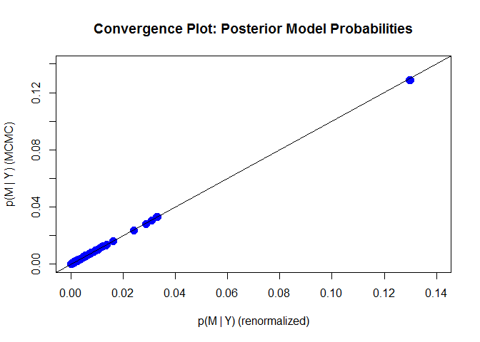<!-- -->

```r
plot2<-diagnostics(bma_score, type = "pip", col = "blue", pch = 16, cex = 1.5)
```

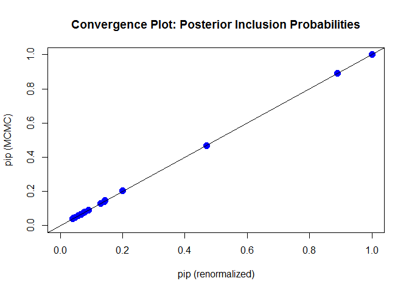<!-- -->

```r
plot(bma_score, which = 1, add.smooth = F, 
     ask = F, pch = 16, sub.caption="", caption="")
abline(a = 0, b = 0, col = "darkgrey", lwd = 2)
```

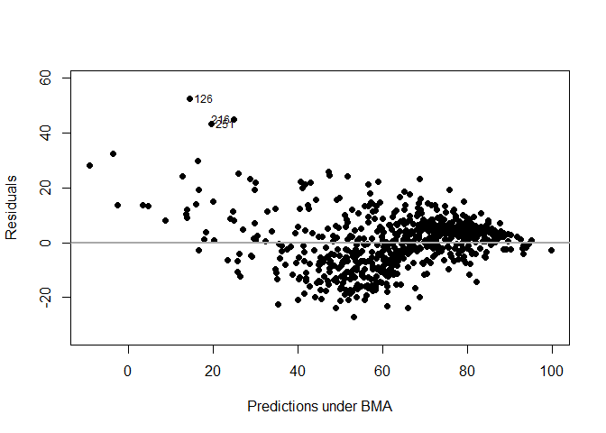<!-- -->

```r
plot(bma_score, which=2, add.smooth = F, sub.caption="", caption="")
```

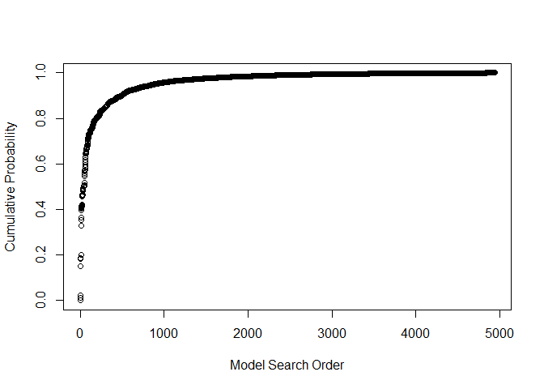<!-- -->


From the above diagnostic plots we are able to see the following: 

(A) **Convergence Plot: Posterior Model Probabilities**: Most points stay in the 45 degree diagonal line, meaing the posterior model probability from the MCMC method has mostly converged to the theoretical posterior model probability.

(B) **Convergence Plot: Posterior Inclusion Probabilities**: All the points are falling on the 45 degree diagonal, we can conclude that the posterior inclusion probability of each variable from MCMC have converged well enough to the theoretical posterior inclusion probability.

(C) **Residuals Versus Fitted Values Using BMA**: Unfortunately, the residuals show more variation for lower fitted audience scores, and less variation for higher fitted audience scores, specifically for scores above 80. Also, observations 126, 216 and 251 may be potential outliers. 

(D) **Cumulative Sampled Probability**: We can see that after we have discovered about 3,000 unique models with MCMC sampling, the probability is starting to level off, indicating that these additional models have very small probability and do not contribute substantially to the posterior distribution.

**Overall:** Overall, the model has converged as indicated by the convergence plots, but the residual plot raises concerns as the residuals do not have constant variance, indicating that some of the assumptions of linear relationship may be violated. 

* * *

## Part 5: Prediction

Let's take the movie: **The Magnificent Seven**

* Rotten Tomatoes: https://www.rottentomatoes.com/m/the_magnificent_seven_2016  
* IMDB: https://www.imdb.com/title/tt2404435/ 

We create a dataframe with all the data points to be fed to the predict function. 


```r
pred_data<-data.frame(matrix(nrow=0,ncol=16)) #create empty data frame

newData<-c("yes","no",133,"yes",2016,"no","no",6.9,178607,64,"no","no","no","no","no","no") #data points

pred_data<-rbind(pred_data,newData) #add row to empty data frame 

colnames(pred_data)<-c("feature_film","drama","runtime","mpaa_rating_R","thtr_rel_year","oscar_season","summer_season","imdb_rating","imdb_num_votes","critics_score","best_pic_nom","best_pic_win","best_actor_win","best_actress_win","best_dir_win","top200_box")

#the next portion ensures that the factor columns have the correct levels and numeric data points are stored as numbers
lvls<-c("no","yes")
indx<-c(1,2,4,6,7,11:16)
pred_data[indx]<-lapply(pred_data[indx],factor,levels=lvls)

indx<-c(3,5,8:10)
pred_data[indx]<-lapply(pred_data[indx],function(x) as.numeric(as.character(x)))

str(pred_data)
```

```
## 'data.frame':	1 obs. of  16 variables:
##  $ feature_film    : Factor w/ 2 levels "no","yes": 2
##  $ drama           : Factor w/ 2 levels "no","yes": 1
##  $ runtime         : num 133
##  $ mpaa_rating_R   : Factor w/ 2 levels "no","yes": 2
##  $ thtr_rel_year   : num 2016
##  $ oscar_season    : Factor w/ 2 levels "no","yes": 1
##  $ summer_season   : Factor w/ 2 levels "no","yes": 1
##  $ imdb_rating     : num 6.9
##  $ imdb_num_votes  : num 178607
##  $ critics_score   : num 64
##  $ best_pic_nom    : Factor w/ 2 levels "no","yes": 1
##  $ best_pic_win    : Factor w/ 2 levels "no","yes": 1
##  $ best_actor_win  : Factor w/ 2 levels "no","yes": 1
##  $ best_actress_win: Factor w/ 2 levels "no","yes": 1
##  $ best_dir_win    : Factor w/ 2 levels "no","yes": 1
##  $ top200_box      : Factor w/ 2 levels "no","yes": 1
```

Now, we will **make the prediction using Bayesian Model Averaging or BMA**. 


```r
BMA.new = predict(bma_score, newdata = pred_data, estimator = "BMA", se.fit = TRUE)
confint(BMA.new,parm="pred")
```

```
##          2.5%    97.5%     pred
## [1,] 47.24827 87.95297 68.00729
## attr(,"Probability")
## [1] 0.95
## attr(,"class")
## [1] "confint.bas"
```

The model predicts that the movie has an audience score of 68 with a 95% probability that the score is between 48 and 87. The actual audience score of the movie on Rotten Tomatoes is 72%, so the prediction was not too far off. 

* * *

## Part 6: Conclusion

In the above research, we were able to construct 2^16 models using MCMC methods, and determine posterior inclusion probabilities of the variables. It showed us that `imdb_rating`, `critics_score` and `runtime` had the highest pips and the model with the highest posterior probability included only `imdb_rating`, `runtime`, and `critics_score`. We did not select any one model, but used Bayesian Model Averaging to determine coefficients and make predictions. We carried out model diagnostics and discovered that the residuals did not have constant variance, leading us to think that some linear assumptions were being violated. 

One of the **drawbacks of this modeling exercise was that we did not check for collinearity between variables**, which could influence the posterior inclusion probabilities. Additionally, we used variables like `imdb_rating` and `imdb_num_votes` as explanatory variables even though these attributes of movie popularity, not attributes of the movie itself. 

We also **did not remove any outliers from the data**, and this could be skewing the model. 

Since we saw potential existence of non-linear relationships in the residual plot, we **could have transformed some of the explanatory variables to logs or squares to capture linear relationships in non-linear context.**

We also discussed some of the biases in the data in the first section, giving rise to concerns related to generalizability. 

In the future, I would collect data on more movie attributes such as the marketing budget, production value, original plot vs remake, languages, etc., and also expand the time frame for which I am collecting data. I would remove collinear variables and outliers. I would focus on movie attributes only, removing variables like `imdb_rating` and `imdb_num_votes`. 
